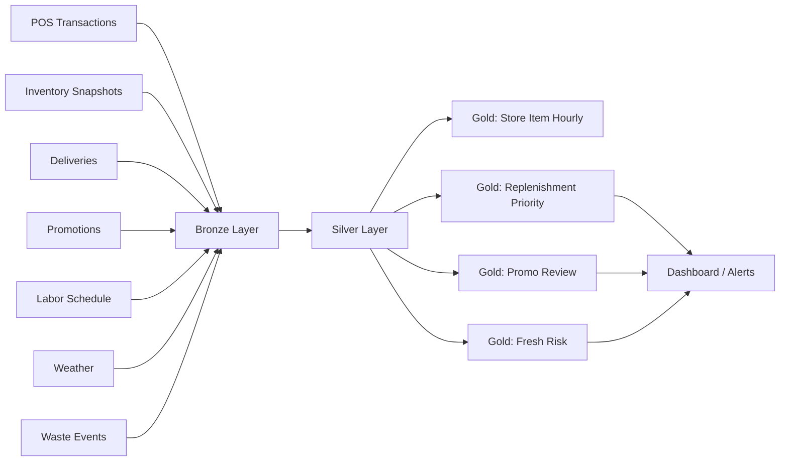

# Architecture

## Medallion flow

## Suggested Databricks implementation

### Ingestion

- Auto Loader or scheduled file ingestion into Delta bronze tables
- partition by business date or event date
- retain ingest timestamp and source file metadata

### Silver transformations

- standardize timestamps to store local time
- deduplicate by source keys
- build consistent store-item grain
- align categories, departments, and promo flags

### Gold transformations

- hourly demand aggregates
- latest on-hand inventory by store-item
- replenishment urgency scoring
- promo baseline versus actual comparison
- fresh/waste risk flags

## Quality checks

- null checks on store, item, and timestamp keys
- duplicate transaction detection
- inventory freshness SLA
- delivery recency sanity check
- promo date validity check

## Good next step after MVP

- add streaming inventory refresh
- add alert thresholds by department
- add simple store-level dashboard in Databricks SQL
- compare predicted versus actual stockout/waste events
